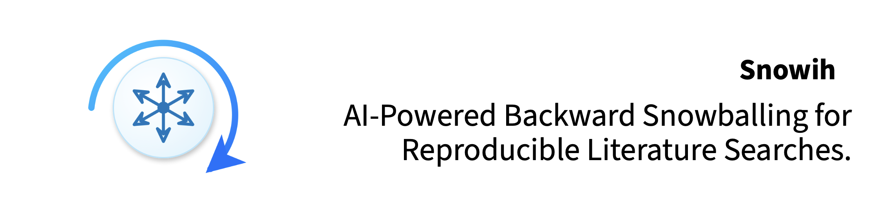
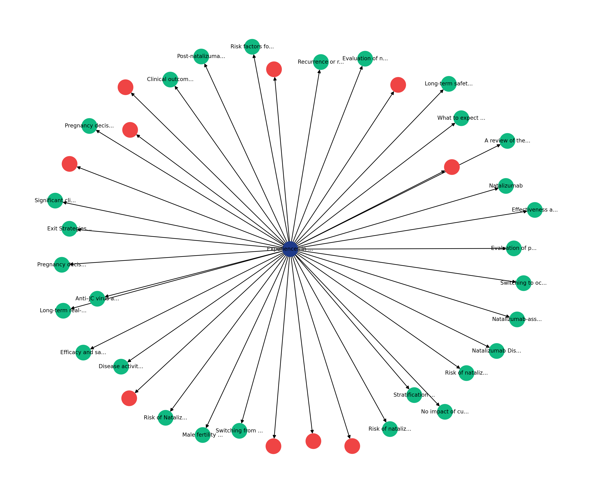
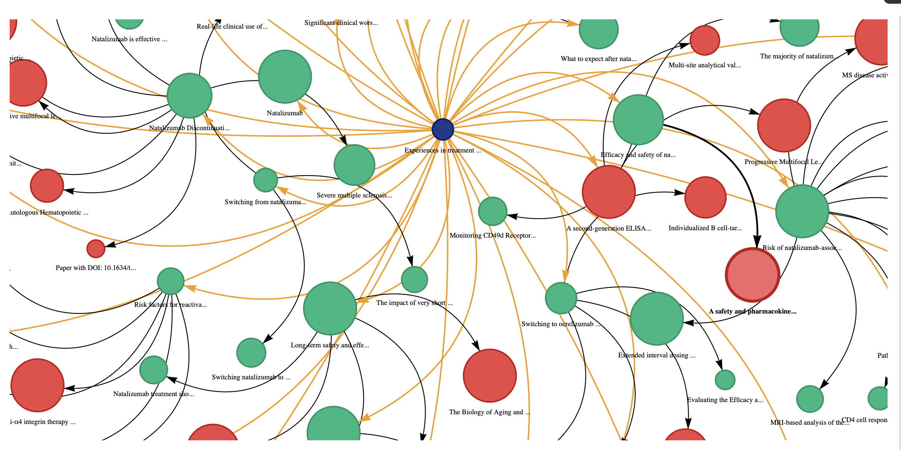
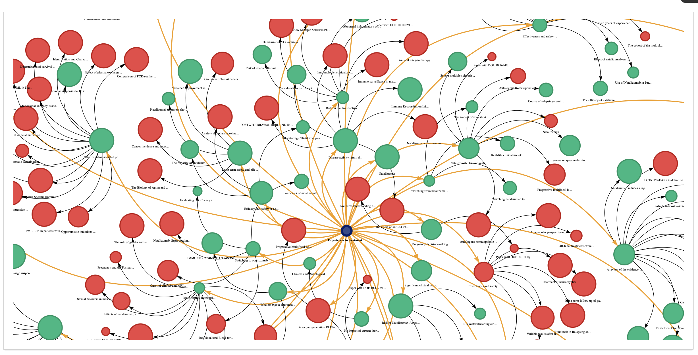
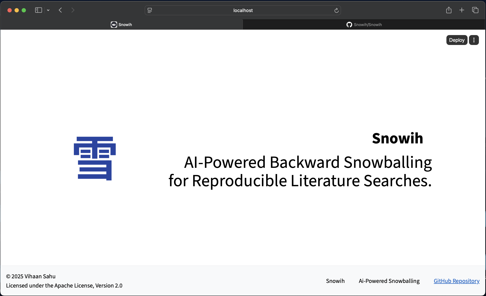

---

**Snowih** is an open-source Python tool for **automating forward and backward snowballing of research papers**.
It identifies references from uploaded studies and recursively explores their cited papers, presenting the entire snowballing pathway through an **interactive, AI-screened graph** that enables reviewers to expand literature searches clearly and reproducibly.

---

## ✨ Key Features

* **AI-Driven Screening**: Users specify inclusion criteria (keywords, title relevance, study type, publication year, etc.), and Snowih’s AI automatically evaluates each reference
* **Recursive Snowballing**: Snowih snowballs the uploaded papers *and* the references of those references—extending the search efficiently across multiple layers
* **Graph-Based Visualisation**: Displays all identified papers as an interactive network graph

  * **Green nodes** → meet inclusion criteria
  * **Red nodes** → excluded based on screening
* **Transparent Decisions**: Each node can be expanded to view AI-generated reasoning for inclusion/exclusion (migth add in future, not done for now)
* **Streamlined Workflow**: Greatly reduces time spent on manual screening in systematic reviews, scoping reviews, and meta-analyses
* **Export Options**: Save screened datasets, graphs, and logs for documentation or PRISMA reporting

* **Future Expansion**: Planned additions include automated deduplication, citation-path mapping, count of studies matching/not matching the user criteria, seperate included/excluded tables that can be downloadable by the users, seperate only citation path mapping (very less likelihood of this cause I'm sure there might be tools for this), AI used is basic for now (will upgrade later on), More ways this tool can be beneficial and more novel, try finding better Ais (Z).
Maybe have a look into forward snowballing but i think that cant happen, for that i need to integrate databases maybe use Access Paper API??? nah lets see. plus its not a simple API send and API receive since its just keyword eligibility based
Also look into the keyword like let users add keyword then comma and more keyword and maybe let them adjust the strictness of ai checking based on new ais temperature and eligibility, also we can add like reviewaid basically say a user puts 5 keywords, as per the strictness (will give user this option), like any 2 keyword selected, eligibilbe rest not, also check the Ais accuracy and precision since it only screens seeingt the title and abstract so you should make this clear to your users, register this on zenodo, 

---

👥 Author

Snowih — Created and Developed by Vihaan Sahu

Maintained under the Snowih Organization

**NOTE:** Snowih is under development currently and is planned to be in production in 2026.

---

## 📄 License

Copyright (c) 2025 Vihaan Sahu

Licensed under the **Apache License 2.0**.

---

# Sample Graphs

Sample graphs

