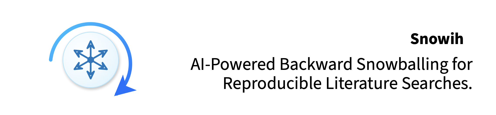
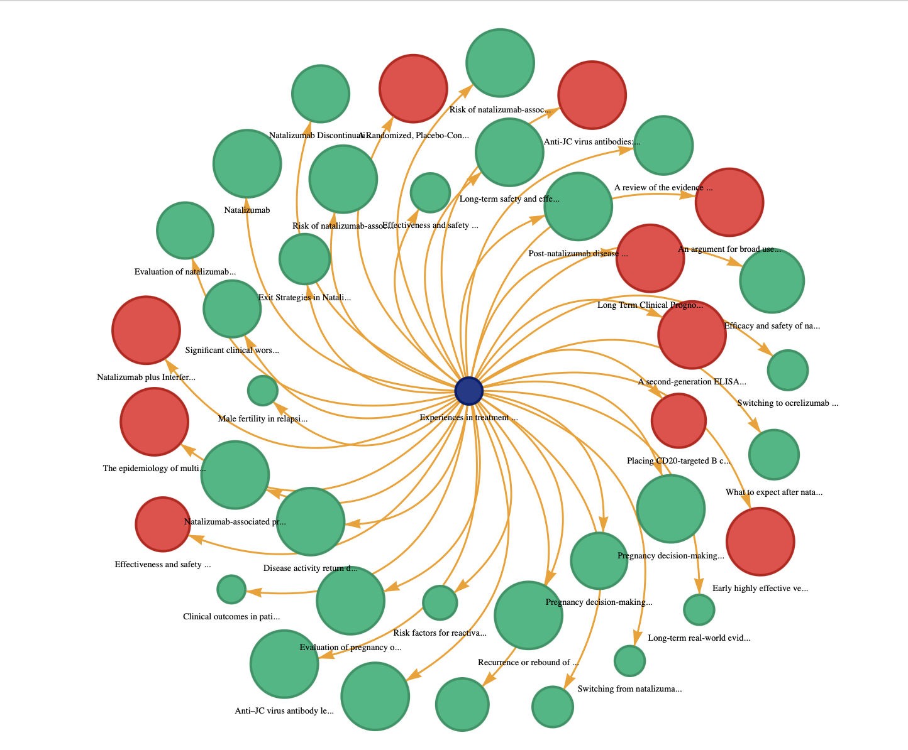
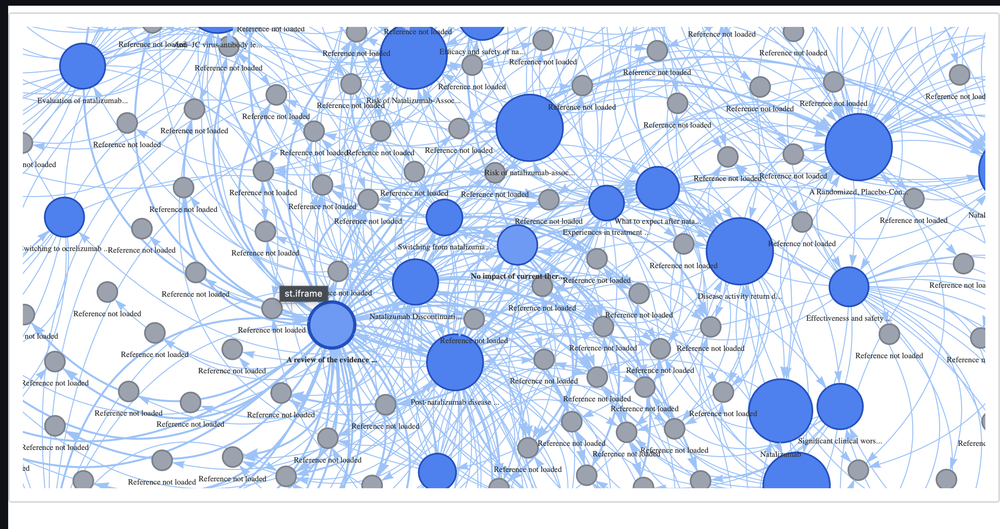
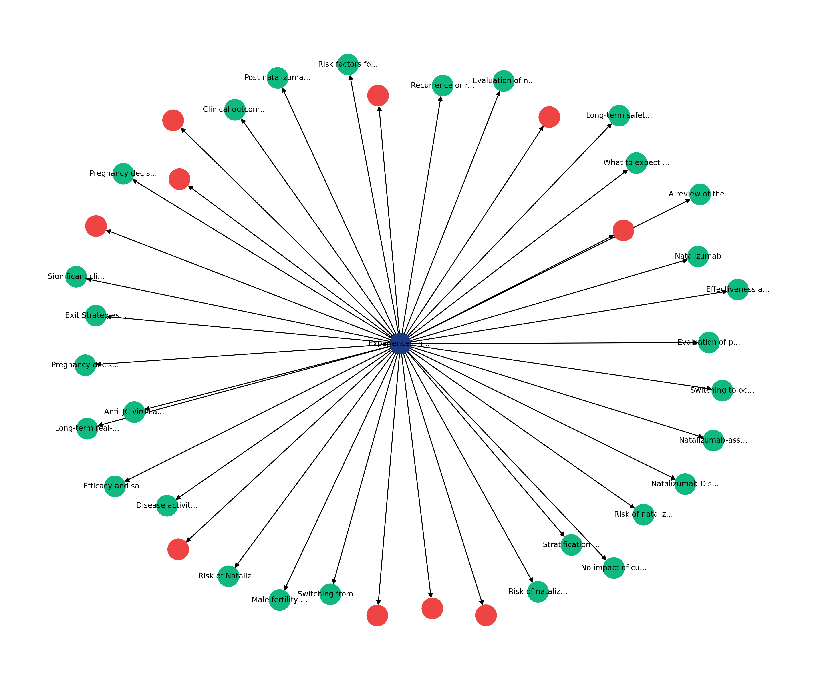
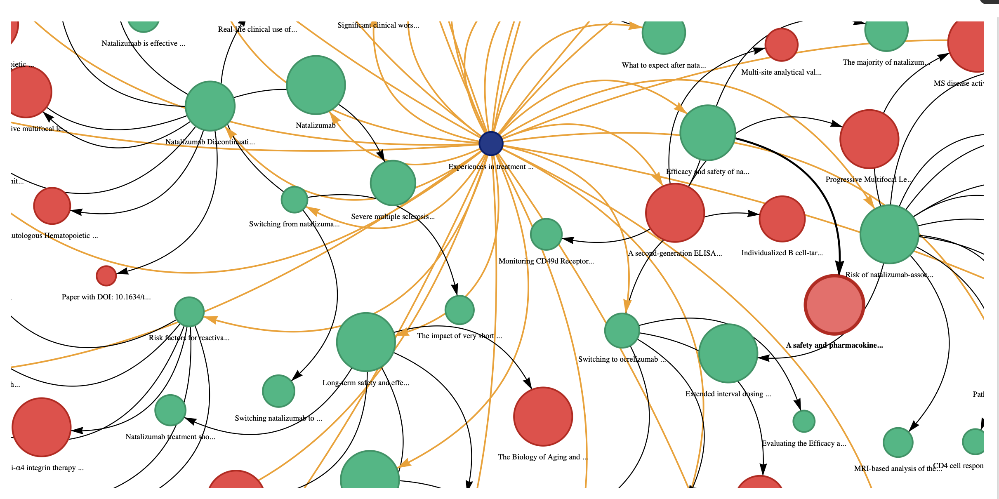
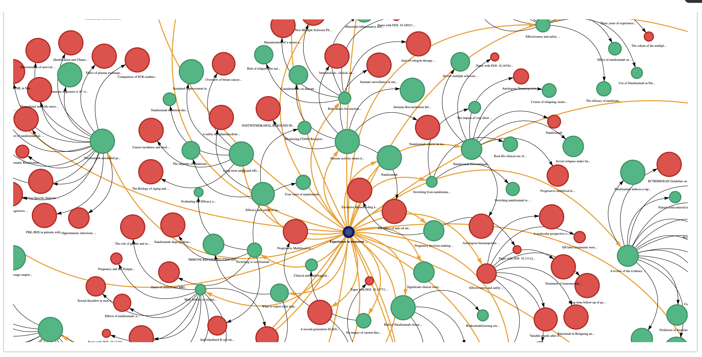

---

**Snowih** is an open-source Python tool for **automating forward and backward snowballing of research papers**.
It identifies references from uploaded studies and recursively explores their cited papers, presenting the entire snowballing pathway through an **interactive, AI-screened graph** that enables reviewers to expand literature searches clearly and reproducibly.

---

## ✨ Key Features

* **AI-Driven Screening**: Users specify inclusion criteria (keywords, title relevance, study type, publication year, etc.), and Snowih’s AI automatically evaluates each reference
* **Recursive Snowballing**: Snowih snowballs the uploaded papers *and* the references of those references—extending the search efficiently across multiple layers
* **Graph-Based Visualisation**: Displays all identified papers as an interactive network graph

  * **Green nodes** → meet inclusion criteria
  * **Red nodes** → excluded based on screening
* **Transparent Decisions**: Each node can be expanded to view AI-generated reasoning for inclusion/exclusion (migth add in future, not done for now)
* **Streamlined Workflow**: Greatly reduces time spent on manual screening in systematic reviews, scoping reviews, and meta-analyses
* **Export Options**: Save screened datasets, graphs, and logs for documentation or PRISMA reporting

---

## Architecture

Snowih/
│
├── app.py            # Main entry point
├── styles.py         # CSS and styling
├── utils.py          # Helper functions and state management
├── api.py            # External API calls (Crossref, Semantic Scholar, etc.)
├── core.py           # Business logic (Screening, Graph building)
├── visualizations.py # Network generation and export logic
└── views.py          # UI rendering functions

---

## 📄 License

Copyright (c) 2025 Vihaan Sahu

Licensed under the **Apache License 2.0**.

**NOTE:** Snowih is under development currently and is planned to be in production in 2026.

---

# Sample Graphs

Sample graphs

